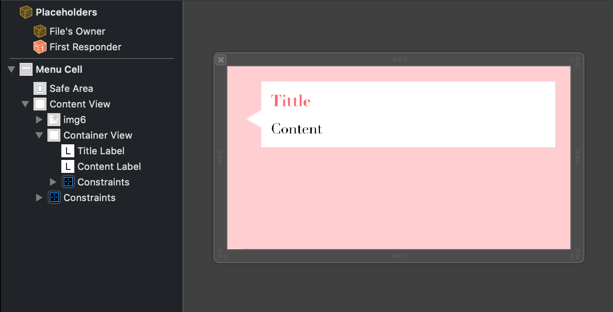
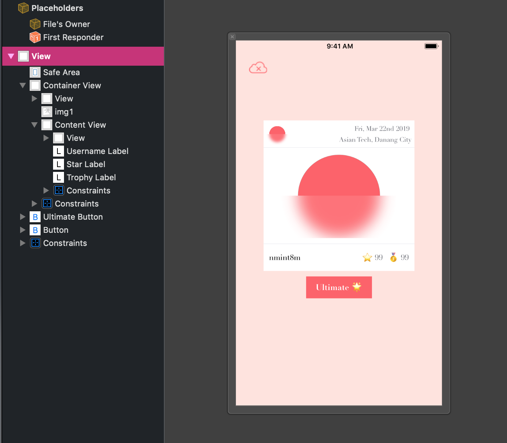
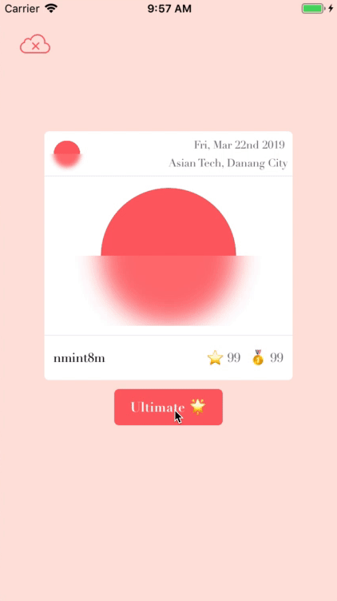
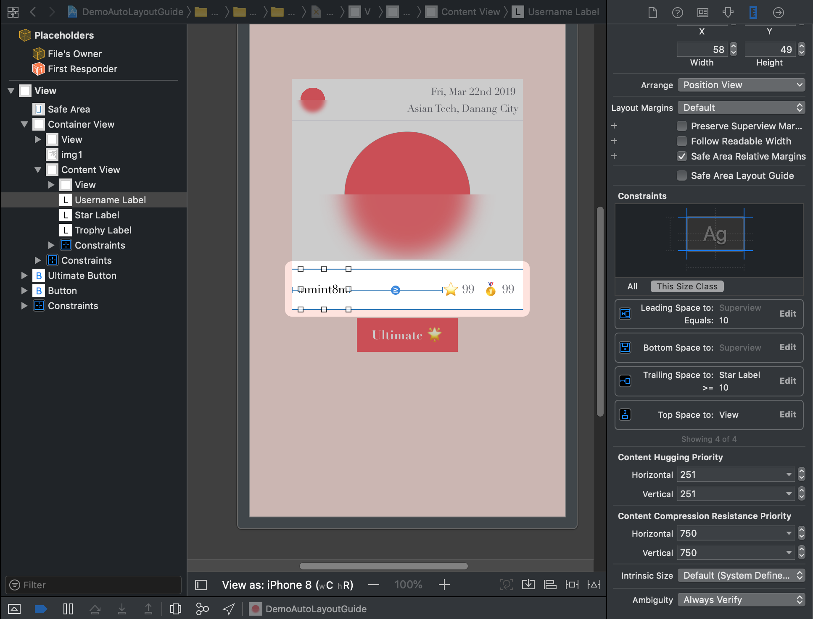

# Auto Layout Guide

_Written by **Nguyen Minh Tam**_

Trong tài liệu này có đề cập đến một số kiến thức cơ bản của auto layout và một số ứng dụng của trong thực tế thường gặp khi develop một iOS application. Tài liệu này được recommend cho các bạn đã làm quen với auto layout trước đó nhe. Trong thời gian tới, mình sẽ viết tài liệu auto layout in iOS for begginer. Nhưng bây giờ hãy xem thử auto layout sẽ làm được gì trước nhé. Let's check it out! 💥

<center>
	
	
	
	
</center>

**Menu**

- [Understanding Auto Layout](#understanding-auto-layout)
	- [Introduce Auto Layout](#introduce-auto-layout)
	- [Auto layout Versus Frame-based layout](#auto-layout-vs-frame-based-layout)
- [Anatomy of a Constraint](#anatomy-of-a-constraint)
	- [Auto Layout Attributes](#auto-layout-attributes)
	- [Creating Nonambiguous, Satisfiable Layouts](#creating-nonambiguous-satisfiable-layouts)
	- [Constraint Priorities](#constraint-priorities)
	- [Intrinsic Content Size](#intrinsic-content-size)
	- [Intrinsic Content Size Versus Fitting Size](#intrinsic-content-size-versus-fitting-size)
- [Auto Layout With Stack View](#auto-layout-with-stack-view)

## Understanding Auto Layout

### Introduce Auto Layout

Auto layout có nhiệm vụ tính toán kích thước và vị trí của tất cả các view trong view hierarchy, dựa vào constraint được cài đặt trong các view đó.

Nhờ hệ thống constraint trong design này mà nó cho phép chúng ta build UI có thể thay đổi linh hoạt theo sự thay đổi của cả bên trong (internal change) và bên ngoài (external change).

#### External Change

External change xảy ra khi size hay hình dạng của supperview thay đổi.

Hầu hết những thay đổi này thường xảy ra lúc runtime và đương nhiên app sẽ phải yêu cầu UI phản hồi liên tục ứng với những thay đổi đó.

Một ví dụ khác nữa, đối với yêu cầu support cho những screen size khác nhau, app cần phải hiển thị phù hợp tương ứng với từng môi trường. Mặc dù đối với trường hợp này, screen size không thay đổi trong suốt runtime, việc tạo nên adaptive interface sẽ hỗ trợ app chạy mượt trên cả iPhone 4S, iPhone 6 Plus và cả trên iPad.

#### Internal Change

Internal change xảy ra khi size của view / control ở phía bên trong UI thay đổi.

Khi content của app thay đổi, chính content này có thể yêu cầu layout khác so với layout cũ. Ví dụ phổ biến nhất là sự thay đổi của nội dung text / image.

Bên cạnh đó, quá trình quốc tế hoá bắt buộc app phải có khả năng thay đổi tương thích với từng ngôn ngữ, vùng miền và văn hoá khác nhau. Layout cho một app mang tính quốc tế thực sự cần quan tâm đến vấn đề này, làm sao để hiển thị một cách chính xác ứng với tất cả các ngôn ngữ và vùng miền mà app đó hỗ trợ.

Sự quốc tế hoá có 3 tác động chính lên layout:

- Khi thay đổi ngôn ngữ, các label yêu cầu chiếm một lượng diện tích khác. Chả hạn như tiếng Đức sẽ chiếm diện tích nhiều hơn tiếng Anh, trong khi đó thường thì tiếng Nhật sẽ tốn ít hơn.

- Format sử dụng cho ngày tháng hay số liệu có thể bị thay đổi theo từng vùng miền, ngay khi ngôn ngữ vẫn giữ nguyên. Mặc dù những thay đổi này tinh vi hơn nhiều so với thay đổi ngôn ngữ, UI vẫn cần phải điều chỉnh lại cho phù hợp với sự biến đổi nhỏ về mặt kích thước đó.

- Thay đổi ngôn ngữ không chỉ thay đổi kích thước của text, mà còn tái cấu trúc lại layout. Đối với từng loại ngôn ngữ khác nhau sẽ có thứ tự sắp xếp layout (layout direction) khác nhau. Ví dụ điển hình như, tiếng Anh có layout direction trái sang phải, nhưng tiếng Ả-rập lại có layout từ phải sang trái. Xét về tổng thể, thứ tự các thành phần trong UI phải tương xứng với layout direction. Nếu một button nằm ở góc dưới bên phải của view ở tiếng Anh, thì nó phải ở góc dưới bên trái ở tiếng Ả-rập.

- Nếu iOS app support dynamic type, đồng nghĩa với việc người dùng có thể thay đổi font size trong app. Điều này dẫn tới việc thay đổi chiều cao lẫn chiều rộng của mọi thành phần chứa text trong UI. Nếu người dùng đổi font size khi app đang chạy, cả font lẫn layout đều phải điều chỉnh.

### Auto layout Versus Frame-based layout

Có ba cách chính để sắp xếp UI:

- Programmatically lay out UI.

- Sử dụng autoresizing mask để tự động hoá việc điều chỉnh ứng với external change.

- Auto layout.

#### Programmatically lay out UI

Về cơ bản app sắp xếp UI bởi việc setting frame cho mỗi view trong view hierarchy. Frame giúp xác định origin, height và width của view nằm trong hệ quy chiếu của superview.

<center>
	
</center>

Có thể nói rằng, define frame của view là cách linh hoạt và chính xác nhất. Tuy nhiên, vì chúng ta phải quản lý tất cả các thay đổi đó, nên với một UI đơn giản đã cần nhiều effort để design, debug và maintain. Việc tạo ra một adaptive UI đúng nghĩa đối với trường hợp này càng khó khi độ phức tạp view càng lớn.

#### Autoresizing mask

Sử dụng autoresizing mask giúp giảm nhẹ effort phải bỏ ra. Autoresizing mask xác định cái cách view frame thay đổi đối ứng với cách superview frame thay đổi. Giải pháp này đơn giản hoá công việc quản lý layout tương thích với external change

Tuy nhiên, autoresizing mask chỉ hỗ trợ đối với một số layout. Đối với UI phức tạp, chúng ta cần sử dụng autoresizing mask kèm thêm programmatically lay out UI. Ngoài ra, autoresizing mask chỉ điều chỉnh theo external change, không hỗ trợ cho internal change.

Autoresizing mask về cơ bản là một giải pháp tương tự programmatic layout, tuy nhiên auto layout lại là một khái niệm khác hẳn. Thay vì nghĩ đến view frame, chúng ta sẽ phân tích về các mối quan hệ giữa chúng.

#### Auto layout

Auto layout điều khiển UI bằng cách sử dụng một chuỗi các constraint. Một constraint mô tả một mối quan hệ giữa 2 view. Sau đó, auto layout tính toán size và vị trí của mỗi view dựa trên những constraint này. Điều này giúp cho layout thay đổi linh hoạt cho cả internal change và external change.

<center>
	
</center>

Để mastering auto layout cần:

- Hiểu logic của constraint-based layout.
- API.

Phần tiếp theo mình sẽ phân tích sâu hơn về constraint trong auto layout.

## Anatomy of a Constraint

*Written by: __Nguyễn Minh Tâm__*

Layout của hệ thống view được xác định bởi một series các linear equation (đẳng thức tuyến tính). Mỗi constraint thể hiện một đẳng thức. Nhiệm vụ của chúng ta là tạo ra một series đẳng thức, mà đẳng thức đó chỉ có duy nhất một nghiệm (possible solution).

Ví dụ đẳng thức sau:

<center>
	
</center>

Constraint này nói rằng leading edge của red view  được neo với trailing edge của blue view và cách 8.0 point. Đẳng thức của constraint này bao gồm một số phần:

- Item 1, Item 2
- Attribute 1, Attribute 2
- Relationship: Mối quan hệ giữa vế bên trái và vế bên phải. Relationship có thể có các dạng sau: =, >=, <=.
- Multipler: Giá trị của attribute 2 được nhân với số float multipler này.
- Constant: Là gía trị được cộng thêm vào vế bên attribute 2.

Một constraint có thể làm được:

<center>
	
</center>

### Auto Layout Attributes

Trong auto layout, attribute định nghĩa các đặc điểm sẽ được constrain sau:

<center>
	
</center>

Ví dụ: Với requirement như sau, bạn sẽ chọn cách nào để giải quyết?

<center>
	
</center>

Bạn có thể chọn một trong những cách sau:

- Sử dụng stack view.
- Layout các view từ trên xuống dưới.
- Dùng một view lớn contain những view nhỏ, các view nhỏ được layout từ trên xuống dưới.
- ... x1001 cách khác

Rõ ràng là auto layout luôn luôn cho chúng ta vô số cách để giải quyết cho cùng một vấn đề. Lý tưởng nhất là chúng ta chọn một solution mô tả ý đồ một cách rõ ràng nhất. Tuy nhiên, đối với các developer khác nhau trong những trường hợp khác nhau sẽ có những solution khác nhau, khó mà đánh giá được solution nào là tốt nhất được. Vậy nên lời khuyên đưa ra là ` being consistent is better than being right`. Vì chúng ta sẽ gặp ít vấn đề hơn trong một khoảng thời gian dài khi chúng ta chọn một cách tiếp cận và `stick with it`.

### Creating Nonambiguous, Satisfiable Layouts

Khi sử dụng auto layout, goal của chúng ta là cung cấp một series đẳng thức chỉ có duy nhất một possible solution. 

Các lỗi khi bạn cung cấp các đẳng thức không cho ra một nghiệm duy nhất:

- Những `Ambiguous constraint` có nhiều hơn một possible solution. 
- Trong khi đó các `Unsatisfiable constraint` thì không có solution.

Ví dụ, auto layout sau đây có lỗi là gì?

```
RedView.Top = 1.0 x SuperView.Top + 10
RedView.Leading = 1.0 x SuperView.Leading + 10
```

Vì chưa xác định kích thước cụ thể cho view nên nó sẽ hiển thị lỗi `Unsatisfiable constraint`.

<center>
	
</center>

Để sửa lỗi, chỉ cần cung cấp thêm kích thước cho nó:

```
RedView.Top = 1.0 x SuperView.Top + 10
RedView.Leading = 1.0 x SuperView.Leading + 10
RedView.Width = 30.0
RedView.Height = 30.0
```

Về mặt tổng quát, khi đã sử dụng auto layout, ta cần phải khai báo constraint đầy đủ size và position cho tất cả view. 

### Constraint Priorities

Phần kiến thức dễ bị bỏ sót khi làm việc với Auto layout: Constraint priorities. Trong mỗi constraint có property `priority` mô tả độ ưu tiên của constraint đó so với những constraint khác.

Mặc định, tất cả constraint đều là `required`. Chúng ta có thể tạo ra một optional constraint. Mọi constraint có priority từ 1 đến 1000. Constraint với priority = 1000 là `required constraint`. Còn lại là `optional constraint`.

Cách thức tính toán của auto layout như sau:

- Auto layout sẽ tính toán solution có thể thoả mãn tất cả constraint.
- Nếu nó không tính ra solution thì nó sẽ in ra error cùng các unsatisfiable constraint lên console và chọn một constraint nào đó rồi bỏ nó đi.
- Sau đó nó lại tính toán solution lại một lần nữa mà không có đẳng thức của constraint vừa bị bỏ.
- Khi tính toán solution, autolayout sẽ hướng việc thoả mãn các constraint có priority theo thứ tự từ cao đến thấp.
- Nếu nó không thoả mãn được một optional constraint nào đó, constraint đó sẽ được bỏ qua và đến constraint tiếp theo.
- Mặc dù optional constraint có thể không được thoả mãn, nó vẫn có ảnh hưởng đến layout. Tức là nếu sau khi skip constraint, layout chưa được tính toán rõ ràng, hệ thống sẽ chọn solution thích hợp nhất đối với constraint đó. Trong trường hợp này, unsatisfied optional constraint sẽ kéo các view về phía nó.

Các optional constraint và các bất đẳng thức hay được làm việc cùng với nhau. Bằng cách cung cấp nhiều priority khác nhau các bất đẳng thức.

> Note: Chúng ta không bắt buộc luôn luôn sử dụng giá trị priority 1000. Thực ra, priority được hệ thống phân loại như sau: low (250), medium (500), high (750), và required (1000). Chúng ta nên đặt các constraint priority tránh những value trên để tránh sự mâu thuẫn.

Ví dụ: Mở `DemoAutoLayoutGuide.xcodeproj` và tới file `SignInVC.xib`.

<center>
	
</center>

```
// Constraint height của image view
ImageView.Height = 50 (priority: 950)

// Thay đổi priority của constraint so top của container view với top của super view
ContainerView.Top = 1.0 x SuperView.Top + 100
(priority: 900 → 800)
ContainerView.Top = 1.0 x SuperView.Top + 50
(priority: 850)
```
Cách thức tính toán layout trong trường hợp này:

- Bỏ qua constraint height của image view.
- Thoả mãn các constraint so top của container view với top của super view theo priority từ cao đến thấp.

Trước khi tìm hiểu phần tiếp theo, chúng ta hãy quay lại ví dụ RedView lỗi unstatisfied layout ở phía trên:

```
RedView.Top = 1.0 x SuperView.Top + 10
RedView.Leading = 1.0 x SuperView.Leading + 10
```

Nếu thay đổi RedView thành RedLabel thì kết quả sẽ như thế nào?

```
RedLabel.Top = 1.0 x SuperView.Top + 10
RedLabel.Leading = 1.0 x SuperView.Leading + 10
```

Câu trả lời là đối với trường hợp RedLabel này, layout không hề bị lỗi. Là do super power của RedLabel chăng? Lý do sẽ được giải thích cụ thể trong phần dưới.

<center>
	
</center>

### Intrinsic Content Size

Nếu các bạn để ý, tất cả ví dụ layout ở trên đều sử dụng constraint để khai báo đầy đủ size và position cho view. 

Tuy nhiên, đối với một số trường hợp chỉ cần khai báo position là đủ. Vì một số view vốn dĩ đã có natural size, được xác định bởi kích thước của content bên trong. Nó được gọi là `intrinsic content size` (ICS). 

Ví dụ như, một button có `intrinsic content size` bao gồm title cộng với một khoảng margin nhỏ.

Tất nhiên là không phải view nào cũng có ICS. Đối với những view có ICS, thì ICS có thể xác định heigh, width hoặc cả hai cho view đó. 

Sau đây là ví dụ ICS đối với một số controls phổ biến:

| View | Intrinsic content size |
| --- | --- |
| UIView and NSView | No intrinsic content size. |
| Sliders | Defines only the width (iOS). Defines the width, the height, or both—depending on the slider’s type (OS X). |
| Labels, buttons, switches, and text fields | Defines both the height and the width. |
| Text views and image views | Intrinsic content size can vary. |

ICS được tính dựa trên nội dung đang chứa hiện tại trong view. 

- ICS của label hay button dựa trên lượng text được show và font được sử dụng. Đối với những view khác, ICS phức tạp hơn nhiều.
- Ví dụ như đối với một image view rỗng thì nó không có ICS. Chỉ cho tới khi chúng ta thêm image, ICS được set bằng size của image đó.
- ICS của text view thay đổi dựa theo content, vào việc scrolling có được enable hay không và dựa vào những constraint khác được set lên view nữa:
	- Ví dụ khi scrolling được enable, text view lúc này không cần có ICS.
	- Khi scrolling bị disable, ICS của text view được tính bởi size của text, không tính đường bao xung quanh. Trường hợp text rỗng, nó rẽ trả về height và width cho nội dung của một line text.
	- Nếu chúng ta add constraint cho width thì ICS sẽ định nghĩa height bắt buộc để display đủ text trong khoảng width giới hạn đó.

Các bạn có thể theo dõi ví dụ ở file `ViewVC.swift`, `ImageViewVC.swift` và `TextViewVC.swift` để so sánh ICS của các controls được đề cập phía trên.

Ví dụ: Mở `DemoAutoLayoutGuide.xcodeproj` và tới file `MenuCell.xib`:

```
ContentLabel.Bottom = ContainerView.Bottom + 10 (priority: 1000)
ContainerView.Bottom >= ContentView.Bottom + 5 (priority: 1000)
```

<center>
	
</center>

Lúc này, chúng ta chỉ mới thấy được chiều cao của container view đang phụ thuộc vào ICS của content label (do đẳng thức thứ 1). Run project, chúng ta sẽ thấy được sự ảnh hưởng ICS của label lên chiều cao của menu cell vì lúc này bất đẳng thức thứ 2 được auto layout đưa vào để tính toán.

Qua ví dụ đơn giản trên, chúng ta đã hiểu được ICS là gì và có tác dụng như thế nào. Ngay tiếp theo, ta sẽ tìm hiểu vì sao ICS lại có tác dụng như thế.

Bởi vì auto layout biểu diễn ICS của view dựa trên một cặp constraint cho mỗi chiều (dimension), trong đó:

- `Content hugging` kéo view vào phía bên trong để nó ôm khít content của nó.
- `Compression resistance` đẩy view ra phía ngoài để tránh cho nó cắt mất content của nó.

<center>
	
</center>

Những constraint này được biểu diễn bằng bất đẳng thức như phía bên dưới. Trong đó `IntrinsicHeight` và `IntrinsicWidth` constant biểu diễn chiều cao và rộng của intrinsic content size của view:

```
// Compression Resistance
View.height >= 0.0 * NotAnAttribute + IntrinsicHeight
View.width >= 0.0 * NotAnAttribute + IntrinsicWidth
 
// Content Hugging
View.height <= 0.0 * NotAnAttribute + IntrinsicHeight
View.width <= 0.0 * NotAnAttribute + IntrinsicWidth
```

Mỗi loại constraint trên cũng có priority riêng của nó. Mặc định, view set 250 cho `content hugging` và 750 cho `compression resistance`. Vậy nên là dễ kéo view giãn ra hơn là co view nhỏ lại.

Trong một số trường hợp, nếu được thì chúng ta nên sử dụng ICS của view. Vì nó giúp cho layout linh hoạt hơn, đáp ứng với sự thay đổi khi content của view bị thay đổi, điển hình ở ví dụ Menu. Nó cũng giúp làm giảm đi số lượng constraint mà chúng ta cần tạo ra để tạo ra một layout nonambiguous, nonconflicting. Việc của chúng ta là chỉ phải quản lý `content hugging priotity` và `compression resistance priotity` (CHCR priority). Dưới đây là một số hướng dẫn và ví dụ cho handle ICS:

Ví dụ 1: Mở `DemoAutoLayoutGuide.xcodeproj` và tới file `DetailVC.xib`. Ta có 3 label lần lượt là: `usernameLabel`, `starLabel` và `trophyLabel`. Khi bấm `ultimateButton`, 3 label trên sẽ thay đổi nội dung. Yêu cầu cần đạt được ở đây là làm sao cho nội dung của 3 label này lấp đầy content view, `starLabel` và `trophyLabel` nằm bên phải và hiển thị nội dung đầy đủ trong khi `nameLabel` nằm bên trái và nội dung của nó có thể bị lượt bỏ.

<center>
	
</center>

Nếu như layout theo cách bình thường chỉ neo top, leading, trailing, bottom thì sẽ không đúng yêu cầu như ờ phía bên phải:

| Right | Wrong |
| --- | --- |
|  |  |

Lý do là vì kéo giãn nhiều view để fill đầy một khoảng không gian cố định, nếu tất cả các view đó đều có content-hugging priority bằng nhau, thì layout sẽ ambiguous. Vì AL không biết view nào sẽ bị kéo giãn ra và view nào sẽ thu nhỏ lại.

Để giải quyết vấn đề thì solution dễ nhất là hạ giá trị horizontal compression assistance priority của `usernameLabel` bé hơn giá trị của `starLabel` và `trophyLabel`như ở `DemoAutoLayoutGuide.xcodeproj` và tới file `DetailLevel99VC.xib`.

<center>
	
</center>

Trong đó:

```
UsernameLabel.HorizontalContentCompressionAssistancePriority = 750
StarLabel.HorizontalContentCompressionAssistancePriority = 751
TrophyLabel.HorizontalContentCompressionAssistancePriority = 751
```

Ví dụ 2: Một số trường hợp không mong muốn đối với một số button hay label, phần background phía sau hay bị kéo giãn ra to so với ICS của nó dẫn tới việc text hiển thị không đúng vị trí. Chúng ta giải quyết trường hợp này bằng cách tăng content-hugging priority của control đó lên.

Ví dụ 3: Baseline constraint chỉ làm việc với những view có **intrinsic content height**. Nếu view đó bị kéo giãn / ép lại theo chiều dọc thì baseline constraint không còn được điều chỉnh đúng nữa.

Ví dụ 4: Đối với một số view, như UISwitch chả hạn, nó nên luôn được hiển thị đúng với ICS. Vậy nên ta cần tăng CHCR priority để tránh việc kéo dãn / ép lại.

Ví dụ 5: Nên tránh việc set CHCR priority = 1000 (required CHCR priority). Vì tốt hơn là để view hiển thị sai kích thước hơn là tạo ra conflict layout. Vậy nên nếu một view cần phải hiển thị đúng với ICS, ta nên set priority cao (như 999 chả hạn). Với cách tiếp cận này, về mặt tổng thể, nó sẽ khiến cho view được kéo giãn / ép lại với giá trị suýt soát nhất có thể.

### Intrinsic Content Size Versus Fitting Size

Intrinsic content size như là input vào auto layout. Khi view có intrinsic content size, hệ thống sẽ sự động generate các constraint thể hiện kích thứơc đó và các constraint lại được dùng để tính toán layout.

Mặt khác, fitting size lại là output từ auto layout. Nó là size được tính toán xuất ra cho view, dựa vào các constraint của view.

Stack view là một ví dụ điển hình. Hệ thống tính toán size của stack view dựa trên nội dung và các attribute được set trong stack view. Stack view hoạt động như nó có intrinsic content size, nhưng thật ra không phải vậy, stack view có fitting size. Chúng ta sẽ tìm hiểu cụ thể trong phần sau.

